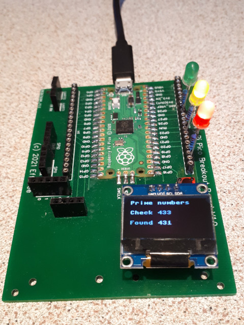

# RPi Pico Breakout Board
A Raspberry Pi Pico Breakout board with PCB layout and some sample MicroPython code.

The Pico µcontroller needs to be soldered on the solderpads of the breakout board (no pin headers). It has breakouts for :
* I2C OLED0 and OLED1 displays
* UART0 and UART1
* SPI0 and SPI1
* ADC
* Reset button  

This repository contains :
1. Schematic and PCB layout files of the breakout board
2. MicroPython demo code (see picture above for the code in action)